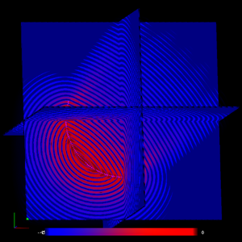

SFS-Visualizer
==============
The sfs-visualizer is a GPU-based software for realtime calculation and visualization
of threedimensional sound fields. It is able to calculate the driving functions
for Wave Field Synthesis and render the sound field in real time. In addition,
it can be used to visualize sound field that were pre computed with the Sound
Field Synthesis Toolbox and stored as mat-fiels.

<p align="center">

</p>

Main features
--------------------------

* im- and export of .mat files with WxHxD-matrizes (datatype single/float works best)
* interactive calculation of monofrequent soundfields via Greens Function
* usage of precalculated or custom sourceconfigurations
* adjusting the position of the primary soundsource
* easy extensible by GLSL-scripts
* taking screenshots
* for fieldvisualization two rendermethods are available (shearwarping and raymarching)
* userdefinable colormapping

Requirements
---------------------------

* Windows PC with an OpenGL 4.3 (compute shaders) enabled videocard 

Usage Examples
----------------------------

* display matlabfile 'data.mat':
```
	sfs-visualizer -m data.mat
```
* display multiple matlabfiles for animation:
```
	sfs-visualizer -m data1.mat -m data2.mat -m data3.mat...
```
* calculate a 128^3 field:
```
	sfs-visualizer -W 128 -H 128 -D 128
```	
* calculate a field with custom sources 
```
	sfs-visualizer -s sources.csv
```
* use specific propertysettings
```	
	sfs-visualizer -p properties.csv
```

Custom Sources
----------------------------

The .csv-file for custom secondary sources has the following structure:
```	
x,y,z,nx,ny,nz,amp
0.2,0.5,0.5,1.0,1.0,1.0,1.0
0.8,0.5,0.5,1.0,1.0,1.0,1.0
...
```	
The coordinates are normed to values between 0 and 1, corresponding to max{gridSize}.
(nx,ny,nz) is the direction of the secondary source and amp its amplitude
weight. 

Custom Properties
----------------------------

The .csv-file for custom properties has the following structure:
```	
propname, value, step
frequency,1000.0,1.1
...
```	
for available properties press '7'. that creates an export of all current properties, although not all properties need to be set in the .csv-file.
the step-parameter is either a multiplicator or a summand, depending on the property 

Commandline Options
----------------------------

| longform			| shortform | description										|
| :----------------	|:--------- | :------------------------------------------------	|
| matlabfile		| m			| the matlabfilename(s) to be viewed				|
| glslfolder		| g         | the folder containing the glsl-files				|
| sourcedefinition	| s			| the csv-file with sourcedefinitions				|
| colormap          | c			| a bitmap used for colormapping					|
| properties        | p			| a csv-file with propertyvalues					|
| gridWidth			| W			| the Width of the calculation-grid e.g. 300		|
| gridHeight		| H			| the Height of the calculation-grid e.g. 300		|
| gridDepth			| D			| the Depth of the calculation-grid e.g. 300		|
| interval			| i			| updateintervall for animations in milliseconds	|
| workgroupsize		| w			| Workgroupsize for Compute Shader < 14				|
|					|			| (should divide WxHxD without rest)				|
| fullscreen		| f			| programm starts in fullscreenmode (experimental)	|

Interactive Options
---------------------------

### general options

| key(s)	| description																|
| :--------	| :------------------------------------------------------------------------	|
| 2/"		| change colormapping														|
| 3			| toggle dB								                                    |
| 4			| toggle raytrace (may crash sometime...)									|
| 5			| screenshot																|
| 6			| reset camera																|
| 7			| save current state to properties.csv or overrides the loaded properties -p|
| j			| export current field to data.mat											|
| b/B		| preamplification	(bevore colorclassification)							|
| c			| cut-planes/full															|
| i/I		| show info																	|
| ESC		| Exit																		|
| ./:		| change calculation-interval												|
| -/_		| change calculation-timestepsize											| 
| u/U		| reverse Animation															|
| SPACE		| Stop/Start Animation														|			
| m/M		| amplification (after colorclassification)									|
| o/O		| speed of autorotation around y-axis										|
| o/O + ctrl| speed of autorotation around x-axis										|
| o/O + alt	| speed of autorotation around z-axis										|


### raytrace options

| key(s)			| description					|
| :----------------	| :----------------------------	|   
| y/Y				| threshold						|			
| </>				| alpha premultiplier			|
| x/X				| quality (very expensive)		|

### options with matlabfiles

  mouse: left=rotation (x|y), right:  zoom + rotation (z), wheel:  move z-cut-plane,
  Arrowkeys: step through animation if multiple files loaded

#### textureblend options:
       
| key(s)			| description							|
| :----------------	| :------------------------------------	|   
| wheel + left shift| move x-cut-plane						|			
| wheel + left ctrl | move y-cut-plane						|
| r/R				| change number of textureslices		|
              
### options with GPU calculation
              
 mouse: left=rotation (x|y), right:  zoom + rotation (z),wheel=frequency
 
#### calculation options
 
| key(s)						 | description					|
| :----------------------------- | :---------------------------	|   
| +/*							 | add/remove source			|			
| Arrowkeys						 | move virtual source			|
| p/P							 | size scaling in m			|
| g/G							 | change Sourcesize			|
| mousewheel + left shift		 | Change Phase					|
| mousewheel + left ctrl		 | Opacity						|
| mousewheel + left ctrl + shift | Opacity of cutted area		|        


 Build from source
---------------------------
* preferable use Visual Studio 2012
* get all of the used Libs: SOIL, boost 1.55.0, matio 1.5.2, freeglut 2.8.1 , glew-1.10
* put/build all Libs in the same Directory
* set Environment Variable $SFS_VS_LIB$ to this Directory
* that's it
